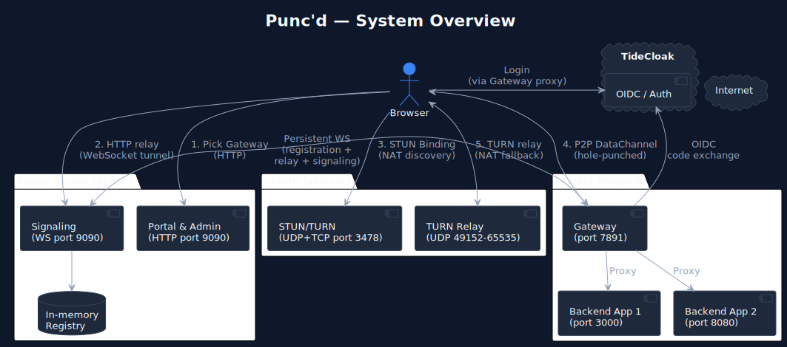
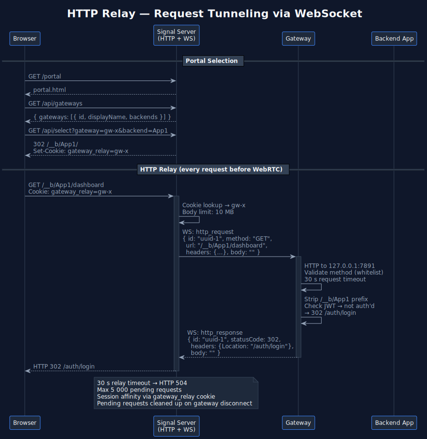
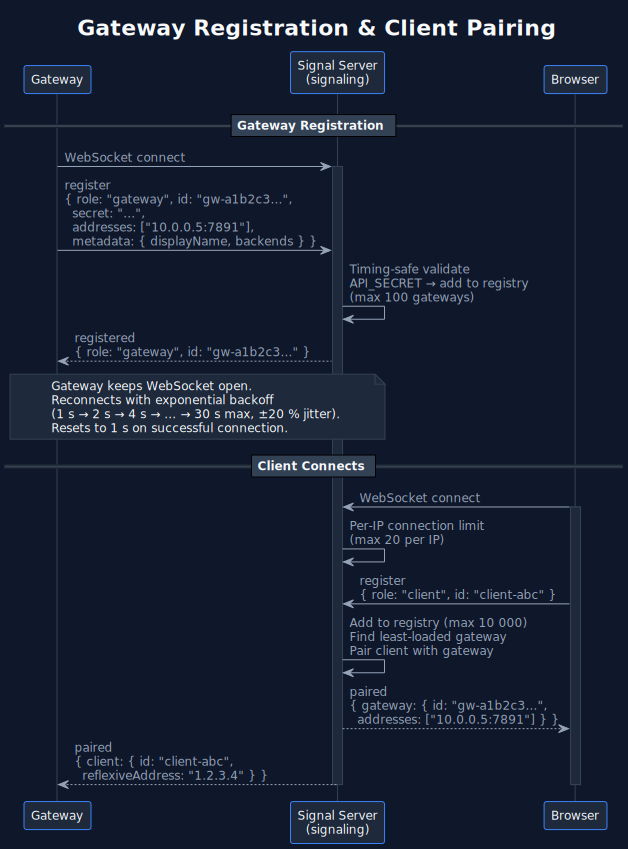
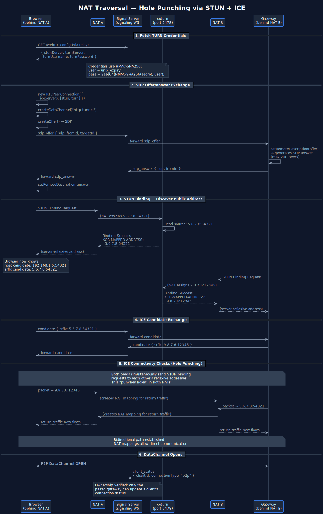
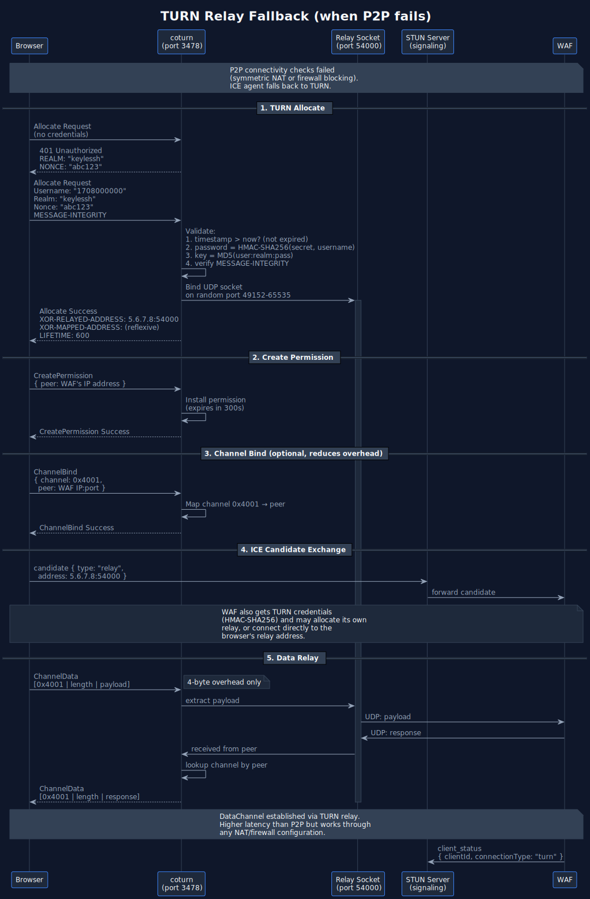
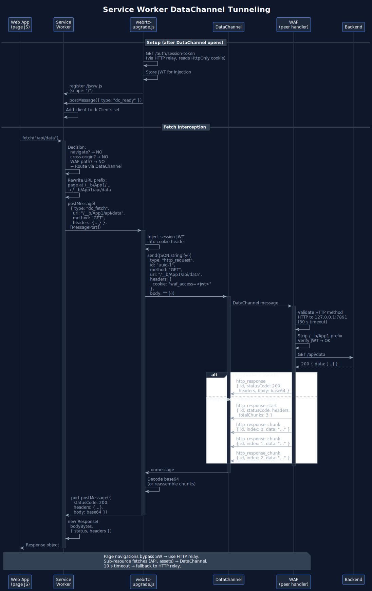
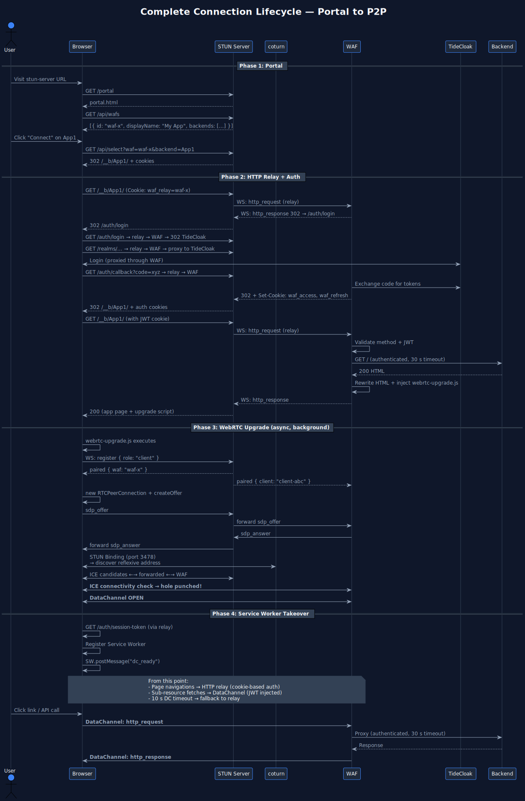
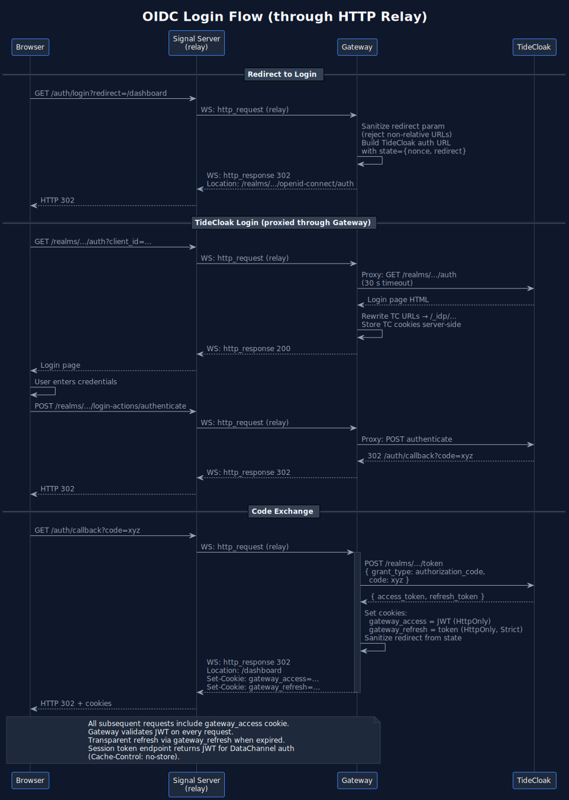
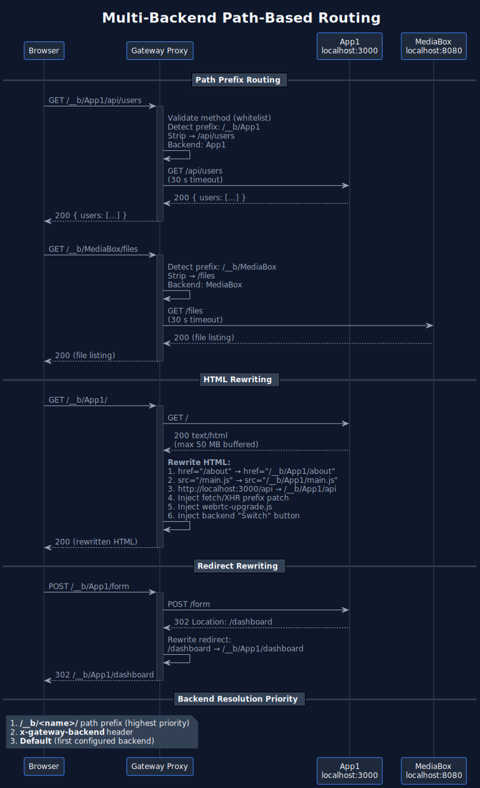

# Punc'd Architecture

Punc'd's signal server and gateway work together to provide authenticated, NAT-traversing access to backend web applications. The signal server acts as a public signaling hub and HTTP relay; a coturn sidecar handles STUN/TURN protocol traffic. The gateway is a local proxy that registers with the signal server and serves traffic from remote clients — first via HTTP relay, then upgraded to peer-to-peer WebRTC DataChannels.

> PlantUML sources are in [docs/diagrams/](diagrams/) if you need to regenerate or edit the SVGs.

## System Overview



**Components:**

| Component | Role | Operator |
|-----------|------|----------|
| **Signal Server** | Signaling (WebSocket), HTTP relay, portal, admin dashboard | Infrastructure operator (public) |
| **coturn** | STUN Binding, TURN Allocate/Relay (RFC 5389/5766) | Infrastructure operator (sidecar, `--network host`) |
| **Gateway** | Authenticating reverse proxy, WebRTC peer handler | Anyone exposing a local app (private network) |

## Connection Lifecycle

### Phase 1 — Portal Selection

The user visits the signal server's public URL. If no `gateway_relay` cookie is set, the signal server serves the portal page (`portal.html`). The user picks which gateway (and optionally which backend) to connect through. Selecting a gateway sets the `gateway_relay` cookie for session affinity and redirects to `/__b/<backend>/` if a specific backend was chosen.

### Phase 2 — HTTP Relay

All subsequent requests are tunneled through the gateway's signaling WebSocket until WebRTC takes over.



**Relay gateway selection order:**
1. `gateway_relay` cookie (session affinity from portal selection)
2. Realm-based routing (match `/realms/<name>/` in URL to gateway metadata)
3. Load-balance: gateway with fewest paired clients

**Relay limits:**
- Request body: 10 MB max (413 if exceeded)
- Pending requests: 5,000 max (503 if exceeded)
- Relay timeout: 30 s (504 if exceeded)
- Pending requests are cleaned up when a gateway disconnects

The HTML response is rewritten by the gateway proxy to:
- Replace `localhost:PORT` URLs with `/__b/<name>` paths (cross-backend routing)
- Prepend `/__b/<name>` to absolute paths in `href`, `src`, `action`, `formaction` attributes
- Inject a fetch/XHR patch script so JS requests with absolute paths get the prefix too
- Inject `webrtc-upgrade.js` before `</body>` (triggers Phase 3)
- Inject a floating "Switch" button (when multiple backends are configured) linking to `/portal`

### Phase 3 — WebRTC Upgrade & NAT Traversal (Hole Punching)

The injected `webrtc-upgrade.js` script upgrades the connection from HTTP relay to a direct peer-to-peer DataChannel. This is the "hole punching" flow.

#### Gateway Registration & Client Pairing



The gateway registers via WebSocket on startup (API secret validated with timing-safe comparison). When a client registers (from `webrtc-upgrade.js`), the signal server pairs it with a gateway — either an explicitly selected gateway (via `targetGatewayId` from the portal) or the gateway with the fewest paired clients.

**Registry limits:** max 100 gateways, max 10,000 clients. Connections exceeding per-IP limits (20) are rejected. Messages are rate-limited to 100/s per connection.

#### ICE Candidate Exchange & STUN Binding

This is where the actual hole punching happens. Both peers gather ICE candidates by probing their network interfaces and sending STUN Binding Requests to coturn.



**How hole punching works:**

1. Both peers (browser and gateway) send STUN Binding Requests to coturn on port 3478
2. coturn responds with each peer's **server-reflexive address** — the public IP:port that the NAT assigned
3. These addresses are exchanged via the signaling channel as ICE candidates
4. Both peers attempt to send packets directly to each other's reflexive addresses
5. When peer A sends a packet to peer B's reflexive address, A's NAT creates a mapping. If B simultaneously sends to A's address, B's NAT also creates a mapping. The packets "punch through" both NATs.
6. Once a bidirectional path is established, the DataChannel opens over this direct path

#### TURN Fallback

If direct P2P fails (symmetric NAT, restrictive firewall), the ICE agent falls back to TURN relay through coturn.



### Phase 4 — Service Worker Takes Over

Once the DataChannel is open, a Service Worker is registered to transparently route sub-resource fetches through the DataChannel instead of HTTP relay.



**Why a session token is needed:** HttpOnly cookies are inaccessible to JavaScript. When requests go through the normal HTTP relay, the browser automatically attaches cookies. But DataChannel messages are pure JavaScript — no cookie jar. So `webrtc-upgrade.js` fetches the JWT once via HTTP relay (`GET /auth/session-token`) and manually injects it into every DataChannel request's cookie header.

**Service Worker routing logic:**
- Navigation requests (page loads) always use relay — new pages need their own DataChannel
- Requests to localhost targeting `/realms/*` or `/resources/*` are rewritten to same-origin (catches TideCloak SDK requests that use internal URLs)
- Non-same-origin requests are ignored
- Gateway-internal paths (`/js/`, `/auth/`, `/login`, `/webrtc-config`, `/_idp/`, `/realms/`, `/resources/`, `/portal`, `/health`) skip DataChannel and go through relay
- **DC readiness gate:** The SW only intercepts requests from clients that have signaled `dc_ready` (tracked in a `dcClients` set). If the requesting client has no active DataChannel, the SW does not call `event.respondWith()` — the browser handles the request natively with proper cookie handling and caching. This prevents stale data when navigating back before the DataChannel reconnects.
- Sub-resource requests without a `/__b/` prefix get the prefix prepended from the requesting page's URL
- DataChannel requests time out after 10 seconds, falling back to relay
- The page-side DataChannel handler times out after 15 seconds, also falling back to relay

**Large response chunking:** Responses over 200KB are split into 150KB chunks to stay within the SCTP message size limit (~256KB):

```
Gateway sends:
  { type:"http_response_start", id, statusCode, headers, totalChunks: 3 }
  { type:"http_response_chunk", id, index: 0, data: "<base64 slice>" }
  { type:"http_response_chunk", id, index: 1, data: "<base64 slice>" }
  { type:"http_response_chunk", id, index: 2, data: "<base64 slice>" }

Browser reassembles all chunks, then resolves the pending fetch.
```

### Complete Lifecycle

End-to-end view: portal selection → authentication → HTTP relay → WebRTC upgrade → Service Worker takeover.



## Authentication Flow

### Gateway OIDC Login (through relay)

TideCloak traffic (`/realms/*`, `/resources/*`) is reverse-proxied through the gateway so the browser never needs direct access to the TideCloak server. The gateway maintains a server-side cookie jar (`tc_sess` cookie → stored TideCloak cookies) with per-session LRU eviction (1-hour TTL, max 10,000 sessions) to avoid relying on the signal relay to forward `Set-Cookie` headers.

**Backend cookie jar:** The gateway also maintains a server-side cookie jar for backend `Set-Cookie` headers, keyed by JWT subject (`sub` claim). When backend responses include `Set-Cookie` headers, the gateway stores them. On DataChannel requests (marked with `x-dc-request: 1` by the peer handler), the gateway injects the stored cookies into the proxied request. This is necessary because DataChannel responses bypass the browser's native cookie handling — the Service Worker cannot set `Set-Cookie` headers on constructed `Response` objects (forbidden header). The backend cookie jar uses the same LRU eviction strategy (7-day TTL, max 10,000 entries). Cookies are stored for all authenticated responses so the jar is seeded from the initial HTTP relay page load.

When `KC_HOSTNAME` is a public URL but TideCloak runs locally, `TC_INTERNAL_URL` tells the gateway where to actually send proxied requests and server-side token exchanges. Browser-facing auth URLs use `AUTH_SERVER_PUBLIC_URL` if set, otherwise relative paths (`/realms/...`) so auth traffic routes through the gateway.

The gateway also handles an `/_idp/` prefix: TideCloak URLs are rewritten to `{publicOrigin}/_idp/...` so the Tide SDK enclave iframe can reach TideCloak through the relay. The gateway strips this prefix before proxying.

**Open redirect prevention:** The `/auth/login?redirect=` parameter and post-callback redirect are sanitized — only relative paths starting with `/` are accepted. Protocol URLs (`https://`, `javascript:`), protocol-relative URLs (`//`), and non-path values are rejected and replaced with `/`.



**Auth endpoints on the gateway:**
- `/auth/login?redirect=<url>` — initiates OIDC redirect to TideCloak (redirect param sanitized)
- `/auth/callback?code=<code>&state=<state>` — exchanges code for tokens, sets `gateway_access` and `gateway_refresh` cookies
- `/auth/session-token` — returns the JWT from the HttpOnly cookie (for DataChannel auth, `Cache-Control: no-store`)
- `/auth/logout` — clears cookies and redirects to TideCloak logout
- `/realms/*`, `/resources/*` — reverse-proxied to TideCloak (public, no auth, 30 s timeout)

**Token validation:**
1. `gateway_access` cookie (HttpOnly, `Lax`)
2. `Authorization: Bearer <jwt>` header
3. If expired, transparent refresh via `gateway_refresh` cookie (`Strict`)
4. Proxied requests include `x-forwarded-user` header with the subject claim

### Portal/Admin TideCloak Auth

The portal and admin pages use `@tidecloak/js` (bundled as `tidecloak.js`) for front-channel OIDC via `IAMService`:

```javascript
IAMService.initIAM(config)  // check-sso with silent iframe
  .then(authenticated => {
    if (!authenticated) IAMService.doLogin();  // redirect to TC
    else start();  // load portal data
  });
```

The signal server's `/auth-config` endpoint serves the TideCloak client config (minus the JWK) as a JavaScript global.

## Multi-Backend Routing

The gateway supports multiple backend services behind a single endpoint using path-based routing.



### Configuration

```bash
BACKENDS="App1=http://localhost:3000,MediaBox=http://localhost:8080"
```

If `BACKENDS` is not set, `BACKEND_URL` is used as a single backend named after `GATEWAY_DISPLAY_NAME` (or "Default").

#### Per-Backend `noauth` Flag

Append `;noauth` to a backend URL to skip gateway-side JWT validation for that backend. Requests are proxied directly without requiring a TideCloak session — useful for backends that handle their own authentication (e.g. an auth server).

```bash
BACKENDS="App=http://localhost:3000,AuthServer=http://localhost:8080;noauth"
```

- **Auth backends** (no `;noauth`): Requests without a valid JWT are redirected to the TideCloak login flow. The gateway sets `x-forwarded-user` from the verified token.
- **No-auth backends** (`;noauth`): Requests are forwarded as-is. No JWT extraction, validation, refresh, or login redirect. No `x-forwarded-user` header is set.

### Path Prefix System

```
Request URL                     Backend          URL forwarded to backend
──────────────────────────────  ───────────────  ────────────────────────
GET /__b/App1/api/data          App1             GET /api/data
GET /__b/MediaBox/dashboard     MediaBox         GET /dashboard
GET /anything-else              First backend    GET /anything-else
```

Backend resolution order:
1. `/__b/<name>` path prefix (highest priority)
2. `x-gateway-backend` header (set by signal relay)
3. First (default) backend

### HTML Rewriting

The gateway rewrites HTML responses (up to 50 MB) to maintain correct routing:

| What | Before | After |
|------|--------|-------|
| Links | `href="/about"` | `href="/__b/App1/about"` |
| Scripts | `src="/main.js"` | `src="/__b/App1/main.js"` |
| Localhost refs | `http://localhost:3000/api` | `/__b/App1/api` |
| JS fetch/XHR | `fetch("/api/data")` | `fetch("/__b/App1/api/data")` (via injected patch) |
| Redirects | `Location: /dashboard` | `Location: /__b/App1/dashboard` |

The injected fetch/XHR patch skips gateway-internal paths: `/js/`, `/auth/`, `/login`, `/webrtc-config`, `/realms/`, `/resources/`, `/portal`, `/health`.

The Service Worker also rewrites URLs — if the page is at `/__b/App1/dashboard` and it fetches `/api/data`, the SW prepends `/__b/App1`.

## TURN Protocol Details

### coturn

STUN/TURN protocol handling is delegated to [coturn](https://github.com/coturn/coturn), running as a Docker sidecar with `--network host`. coturn handles:

- STUN Binding Requests/Responses (RFC 5389) for NAT discovery
- TURN Allocate/Refresh/Send/CreatePermission/ChannelBind (RFC 5766) for relay fallback
- Ephemeral credential validation via HMAC-SHA256 shared secret

The signaling server and gateway only handle WebSocket signaling; all UDP/TCP STUN/TURN traffic goes directly to coturn.

### TURN REST API Credentials (HMAC-SHA256)

Both the gateway and coturn share a `TURN_SECRET`. The gateway generates short-lived credentials for clients:

```
username = String(Math.floor(Date.now() / 1000) + 3600)   // expires in 1 hour
password = Base64(HMAC-SHA256(TURN_SECRET, username))
```

coturn validates by recomputing the HMAC-SHA256 and checking the expiry timestamp. The `--auth-secret-algorithm=sha256` flag tells coturn to use SHA-256 instead of the legacy SHA-1 default.

### STUN Message Format (RFC 5389)

```
 0                   1                   2                   3
 0 1 2 3 4 5 6 7 8 9 0 1 2 3 4 5 6 7 8 9 0 1 2 3 4 5 6 7 8 9 0 1
+-+-+-+-+-+-+-+-+-+-+-+-+-+-+-+-+-+-+-+-+-+-+-+-+-+-+-+-+-+-+-+-+
|0 0|     STUN Message Type     |         Message Length        |
+-+-+-+-+-+-+-+-+-+-+-+-+-+-+-+-+-+-+-+-+-+-+-+-+-+-+-+-+-+-+-+-+
|                    Magic Cookie (0x2112A442)                   |
+-+-+-+-+-+-+-+-+-+-+-+-+-+-+-+-+-+-+-+-+-+-+-+-+-+-+-+-+-+-+-+-+
|                                                               |
|                  Transaction ID (96 bits)                      |
|                                                               |
+-+-+-+-+-+-+-+-+-+-+-+-+-+-+-+-+-+-+-+-+-+-+-+-+-+-+-+-+-+-+-+-+
```

### Supported TURN Methods

| Method | Code | Auth Required |
|--------|------|---------------|
| Binding | 0x001 | No |
| Allocate | 0x003 | Yes (TURN) |
| Refresh | 0x004 | Yes (TURN) |
| Send | 0x006 | No (indication) |
| Data | 0x007 | No (indication) |
| CreatePermission | 0x008 | Yes (TURN) |
| ChannelBind | 0x009 | Yes (TURN) |

### TURN Data Relay

Two transport modes within an allocation:

| Mode | Overhead | Description |
|------|----------|-------------|
| Send/Data indication | 36+ bytes | Full STUN header per packet |
| ChannelData | 4 bytes | `channelNumber:2 + length:2` header only |

ChannelBind maps a 16-bit channel number (0x4000-0x7FFF) to a specific peer IP:port, enabling the low-overhead ChannelData framing. A channel binding implicitly installs a permission.

### Packet-Type Detection

The first byte of each UDP/TCP packet determines the protocol:

```
Bits 7-6 = 00  →  STUN message (RFC 5389)
Bits 7-6 = 01  →  ChannelData (TURN, channel numbers 0x4000-0x7FFF)
```

## Security

### Security Headers

Both servers set on every response:
- `X-Content-Type-Options: nosniff`
- `Referrer-Policy: strict-origin-when-cross-origin`

The signal server sets `X-Frame-Options: DENY`. The gateway sets `X-Frame-Options: SAMEORIGIN` (Tide SDK enclave uses iframes).

### Request Validation

- **HTTP method whitelist:** Only `GET`, `POST`, `PUT`, `PATCH`, `DELETE`, `HEAD`, `OPTIONS` are allowed. Other methods return 405. Applied at all three request entry points (relay, DataChannel, backend proxy).
- **Open redirect prevention:** Auth redirect parameters only accept relative paths starting with `/`.
- **Body size limits:** 10 MB for relay requests, 64 KB for API POST bodies, 50 MB for proxied response buffering.

### Authentication & Secrets

- **API_SECRET:** Gateway registration with the signal server uses timing-safe comparison (`crypto.timingSafeEqual`).
- **TURN_SECRET:** Shared secret for HMAC-SHA256 ephemeral TURN credentials.
- **Gateway ID:** Generated with `crypto.randomBytes(8).toString("hex")` (16 hex chars) for cryptographic uniqueness.

### Rate Limiting & Capacity

| Resource | Limit | Behavior when exceeded |
|----------|-------|----------------------|
| WebSocket connections per IP | 20 | Connection rejected (close 1013) |
| Messages per connection per second | 100 | Connection closed (close 1008) |
| WebSocket message size | 1 MB | Message rejected |
| Registered gateways | 100 | Registration rejected |
| Registered clients | 10,000 | Registration rejected |
| Pending relay requests | 5,000 | HTTP 503 |
| WebRTC peer connections per gateway | 200 | New offers rejected |
| Admin WebSocket subscribers | 50 | Subscription rejected |
| TC cookie jar sessions | 10,000 | LRU eviction |

### Proxy Timeouts

All proxy requests (TideCloak, backend, relay loopback, DataChannel loopback) have a 30-second timeout. On timeout, the request is destroyed and a 504 response is returned.

### Connection Resilience

**Gateway → signal server:** The gateway reconnects to the signal server with exponential backoff: 1 s → 2 s → 4 s → 8 s → ... → 30 s max, with ±20% jitter. The delay resets to 1 s on successful connection. When a gateway disconnects, all its pending relay requests are rejected immediately (502) rather than waiting for the 30 s timeout.

**Browser → DataChannel:** The `webrtc-upgrade.js` script automatically reconnects when the DataChannel or signaling WebSocket drops. On disconnect:
1. Cleans up the PeerConnection and DataChannel
2. Rejects all pending DataChannel requests (falling back to relay)
3. Notifies the Service Worker (`dc_closed`) so it stops intercepting
4. Schedules reconnect with exponential backoff: 5 s × 1.5^n, max 60 s
5. On reconnect: fetches a fresh session token, generates a new client ID, reconnects signaling
6. Backoff resets to 0 on successful DataChannel open

ICE failure (`iceConnectionState === "failed"`) also triggers cleanup and reconnect.

## Port Summary

| Component | Port | Protocol | Purpose |
|-----------|------|----------|---------|
| coturn | 3478 | UDP + TCP | STUN Binding, TURN Allocate/Refresh/Send/ChannelBind |
| Signal server | 9090 | HTTP/WS (or HTTPS/WSS) | Signaling, portal, admin, HTTP relay, health check |
| coturn | 49152-65535 | UDP | TURN relay sockets (one per allocation) |
| Gateway | 7891 | HTTP or HTTPS | Proxy server (auth + backend routing) |
| Gateway | 7892 | HTTP | Health check endpoint |

## Configuration Reference

### coturn

coturn is configured via CLI flags in `docker-compose.yml` or `deploy.sh`. Key settings:

| Flag | Default | Description |
|------|---------|-------------|
| `--listening-port` | 3478 | STUN/TURN protocol port |
| `--external-ip` | (required) | Public IP for TURN relay addresses |
| `--static-auth-secret` | (required) | Shared secret for TURN credentials |
| `--auth-secret-algorithm` | sha256 | HMAC algorithm for credential validation |
| `--realm` | keylessh | TURN authentication realm |
| `--min-port` / `--max-port` | 49152-65535 | TURN relay port range |

See [turnserver.conf](../signal-server/turnserver.conf) for the full configuration template.

### Signal Server

| Variable | Default | Description |
|----------|---------|-------------|
| `SIGNAL_PORT` | 9090 | Signaling + HTTP port |
| `API_SECRET` | (none) | Shared secret for gateway registration (timing-safe validated) |
| `TIDECLOAK_CONFIG_B64` | (none) | Base64 TideCloak adapter config (enables admin JWT auth) |
| `TLS_CERT_PATH` | (none) | TLS cert for signaling port (enables HTTPS/WSS) |
| `TLS_KEY_PATH` | (none) | TLS key for signaling port |

### Gateway

| Variable | Default | Description |
|----------|---------|-------------|
| `STUN_SERVER_URL` | (required) | WebSocket URL of the signal server signaling port |
| `LISTEN_PORT` | 7891 | Gateway HTTP/HTTPS port |
| `HEALTH_PORT` | 7892 | Health check port |
| `BACKENDS` | (none) | `"Name=http://host:port,Auth=http://host2:port;noauth"` |
| `BACKEND_URL` | (none) | Single backend URL (fallback if `BACKENDS` not set) |
| `GATEWAY_ID` | random (`gw-<16hex>`) | Unique gateway identifier (cryptographic random) |
| `GATEWAY_DISPLAY_NAME` | GATEWAY_ID | Display name in portal |
| `GATEWAY_DESCRIPTION` | (none) | Description shown in portal |
| `ICE_SERVERS` | derived from `STUN_SERVER_URL` | STUN server for WebRTC, e.g. `stun:host:3478` |
| `TURN_SERVER` | (none) | TURN server URL, e.g. `turn:host:3478` |
| `TURN_SECRET` | (none) | Shared secret for TURN credentials (HMAC-SHA256) |
| `API_SECRET` | (none) | Shared secret for signal server registration |
| `TIDECLOAK_CONFIG_B64` | (none) | Base64 TideCloak adapter config |
| `TIDECLOAK_CONFIG_PATH` | `<project>/data/tidecloak.json` | File path to TideCloak config (fallback if B64 not set) |
| `AUTH_SERVER_PUBLIC_URL` | (none) | Public TideCloak URL for browser redirects |
| `TC_INTERNAL_URL` | config `auth-server-url` | Internal TideCloak URL for proxying and token exchange |
| `HTTPS` | true | Generate self-signed TLS for gateway (`false` to disable) |
| `TLS_HOSTNAME` | localhost | Hostname for the self-signed certificate |
| `STRIP_AUTH_HEADER` | false | Remove `Authorization` header before proxying to backend |

## Signal Server API Routes

The signal server (port 9090) serves these HTTP endpoints in addition to the WebSocket signaling and HTTP relay:

| Path | Method | Auth | Description |
|------|--------|------|-------------|
| `/health` | GET | None | Health check with registry stats |
| `/portal` | GET | None | Portal page (clears `gateway_relay` cookie) |
| `/` | GET | None | Portal if no `gateway_relay` cookie, else relay to gateway |
| `/admin` | GET | None | Admin dashboard page |
| `/api/gateways` | GET | User JWT (if configured) | List registered gateways for portal |
| `/api/admin/stats` | GET | Admin JWT | Detailed stats (gateways, clients, connections) |
| `/api/select-gateway` | POST | None | Set `gateway_relay` cookie (body: `{gatewayId, backend?}`, max 64 KB) |
| `/api/select` | GET | None | Set cookie + redirect (`?gateway=<id>&backend=<name>`) |
| `/api/clear-selection` | POST | None | Clear `gateway_relay` cookie |
| `/auth-config` | GET | None | TideCloak client config as JS global |
| `/silent-check-sso.html` | GET | None | TideCloak silent SSO iframe |
| `/static/*` | GET | None | Static assets |

All other requests are passed to the HTTP relay handler.

## Signaling Message Reference

### WebSocket Messages (signal server signaling)

| Type | Direction | Fields | Description |
|------|-----------|--------|-------------|
| `register` | Gateway/client → server | `id`, `role`, `secret`?, `addresses`?, `metadata`?, `targetGatewayId`? | Register in the registry |
| `registered` | server → gateway/client | `role`, `id` | Registration confirmed |
| `paired` | server → both | `gateway:{id, addresses}` or `client:{id, reflexiveAddress}` | Pairing established |
| `candidate` | bidirectional | `fromId`, `targetId`, `candidate:{candidate, mid}` | ICE candidate forwarding |
| `sdp_offer` | client → gateway (via server) | `fromId`, `targetId`, `sdp`, `sdpType` | SDP offer |
| `sdp_answer` | gateway → client (via server) | `fromId`, `targetId`, `sdp`, `sdpType` | SDP answer |
| `http_request` | server → gateway | `id`, `method`, `url`, `headers`, `body` (base64) | Relay HTTP request |
| `http_response` | gateway → server | `id`, `statusCode`, `headers`, `body` (base64) | Relay HTTP response |
| `client_status` | gateway → server | `clientId`, `connectionType` (`relay`/`p2p`/`turn`) | Connection type update (ownership verified) |
| `subscribe_stats` | admin → server | `token`? | Subscribe to live stats (max 50 subscribers) |
| `stats_update` | server → admin | `gateways[]`, `clients[]` | Live stats (every 3s) |
| `admin_action` | admin → server | `token`, `action` (`drain_gateway`/`disconnect_client`), `targetId` | Admin action |
| `admin_result` | server → admin | `action`, `targetId`, `success` | Admin action result |
| `error` | server → gateway/client | `message` | Error notification |

**Registration metadata** (gateway only): `{ displayName?, description?, backends?: [{name}], realm? }`

**Client `targetGatewayId`**: If set on a `register` message with `role: "client"`, the server pairs the client with that specific gateway instead of load-balancing.

### DataChannel Messages (gateway <-> browser)

| Type | Direction | Fields | Description |
|------|-----------|--------|-------------|
| `http_request` | browser → gateway | `id`, `method`, `url`, `headers`, `body` (base64) | HTTP request over DC |
| `http_response` | gateway → browser | `id`, `statusCode`, `headers`, `body` (base64) | Response (< 200KB) |
| `http_response_start` | gateway → browser | `id`, `statusCode`, `headers`, `totalChunks` | Chunked response start |
| `http_response_chunk` | gateway → browser | `id`, `index`, `data` (base64) | Chunked response part |

### Service Worker Messages (page <-> SW)

| Type | Direction | Fields | Description |
|------|-----------|--------|-------------|
| `dc_ready` | page → SW | (none) | DataChannel is open |
| `dc_closed` | page → SW | (none) | DataChannel closed |
| `dc_fetch` | SW → page | `url`, `method`, `headers`, `body` | Route fetch via DC |

## Secrets & Operator Model

The signal server and gateway can be run by **different operators**. The signal server operator generates secrets and shares them with gateway operators.

| Secret | Generated by | Given to | Purpose |
|--------|-------------|----------|---------|
| `API_SECRET` | Signal server operator | Gateway operators | Authenticates gateway registration (timing-safe validated) |
| `TURN_SECRET` | Signal server operator | Gateway operators | Generates ephemeral TURN relay credentials (HMAC-SHA256) |

**Typical flow:**
1. Signal server operator deploys → secrets auto-generated by `signal-server/deploy.sh`
2. Signal server operator gives `API_SECRET` + `TURN_SECRET` to gateway operators
3. Gateway operator sets them as env vars or pastes when prompted by `./start.sh` or `script/gateway/start.sh`

Secrets are saved to `script/gateway/.env` on first run so you only enter them once.

## Timeouts

| What | Duration | Behavior on timeout |
|------|----------|-------------------|
| HTTP relay (signal → gateway response) | 30 s | 504 to client |
| TideCloak proxy request | 30 s | 504 to client |
| Backend proxy request | 30 s | 504 to client |
| DataChannel loopback request | 30 s | 504 over DataChannel |
| Relay loopback request | 30 s | 504 over WebSocket |
| DataChannel fetch (page-side) | 15 s | Falls back to relay |
| Service Worker fetch (SW-side) | 10 s | Falls back to relay |
| Gateway WebSocket reconnect | 1–30 s | Exponential backoff with ±20% jitter |
| TURN allocation | 600 s (default) | Allocation + permissions + channels deleted |
| TURN permission | 300 s | Permission expired |
| TURN channel binding | 600 s | Channel expired |
| TideCloak cookie jar session | 3600 s | Session evicted (LRU) |

## Local Development

### Start Signal Server

```bash
cd signal-server
npm install
npm run build
npm start
```

On first deploy, `deploy.sh` generates and prints `API_SECRET` and `TURN_SECRET`.

### Start Gateway (connecting to an existing signal server)

```bash
cd gateway
npm install

# Required: signal server URL and secrets (from the signal server operator)
export STUN_SERVER_URL=wss://signal.example.com:9090
export API_SECRET=<from-signal-operator>
export TURN_SECRET=<from-signal-operator>

# Required: at least one backend
export BACKEND_URL=http://localhost:3000
# Or multiple backends (append ;noauth to skip gateway JWT validation):
export BACKENDS="App=http://localhost:3000,Auth=http://localhost:8080;noauth"

# Optional: display name in portal
export GATEWAY_DISPLAY_NAME="My Local Gateway"
export GATEWAY_DESCRIPTION="Development environment"

# Optional: internal TideCloak URL (if KC_HOSTNAME is a public URL)
export TC_INTERNAL_URL=http://localhost:8080

npm run build
npm start
```

Or use the convenience scripts:

```bash
# Full setup (TideCloak + gateway):
./start.sh

# Gateway only (prompts for secrets on first run):
script/gateway/start.sh
```

### Running both locally (Docker Compose)

If you run both components yourself, `docker-compose.yml` wires them together (including coturn):

```bash
docker compose up --build
```

## Troubleshooting

### WebRTC upgrade not happening

- Check browser console for `[WebRTC]` log messages
- Verify `/webrtc-config` returns valid STUN/TURN URLs
- Ensure coturn port 3478 is reachable (UDP and TCP)
- Check that `TURN_SECRET` matches between gateway and coturn
- Verify `ICE_SERVERS` is set on the gateway (derived from `STUN_SERVER_URL` if not explicit)

### TURN allocation failing

- Verify credentials: `TURN_SECRET` must be identical on gateway and coturn
- Ensure coturn is running with `--auth-secret-algorithm=sha256`
- Check that coturn's UDP port range (49152-65535) is accessible
- Look for `401 Unauthorized` in coturn logs (credential mismatch)
- Ensure `EXTERNAL_IP` is set correctly on coturn (required for TURN relay addresses)
- Test credentials manually:
  ```bash
  USER="$(date -d '+1 hour' +%s)"
  PASS=$(echo -n "$USER" | openssl dgst -sha256 -hmac "$TURN_SECRET" -binary | base64)
  turnutils_uclient -u "$USER" -w "$PASS" -p 3478 <coturn-ip>
  ```

### HTTP relay timeout (504)

- The signal server waits 30 seconds for a gateway response
- Check that the gateway is connected (admin dashboard shows gateway status)
- Check gateway logs for errors proxying to the backend
- Pending requests are cleaned up when a gateway disconnects (502 instead of 504)

### Service Worker not intercepting

- The `Service-Worker-Allowed: /` header must be present on `/js/sw.js`
- Check `navigator.serviceWorker.controller` is not null
- Page navigations are intentionally not intercepted (only sub-resources)

### Auth redirect loop

- Ensure `TIDECLOAK_CONFIG_B64` or `TIDECLOAK_CONFIG_PATH` is set on the gateway
- Check that the TideCloak client has the gateway's origin in its valid redirect URIs
- Verify the `gateway_access` and `gateway_refresh` cookies are being set
- If `KC_HOSTNAME` is a public URL, set `TC_INTERNAL_URL=http://localhost:8080` so server-side token exchange reaches TideCloak

### TideCloak proxy issues

- Check that `/realms/*` and `/resources/*` requests are reaching the gateway
- If using `TC_INTERNAL_URL`, ensure the gateway can reach TideCloak at that address
- The Service Worker rewrites localhost TideCloak URLs to same-origin — check for `[SW] Rewriting localhost request:` in console

### Rate limiting / connection issues

- If gateway registration fails, verify `API_SECRET` matches (timing-safe comparison — no timing side-channel)
- If connections are rejected, check per-IP limits (max 20 WebSocket connections per IP)
- If messages are dropped, check rate limits (max 100 messages/s per connection)
- Registry limits: max 100 gateways, max 10,000 clients
